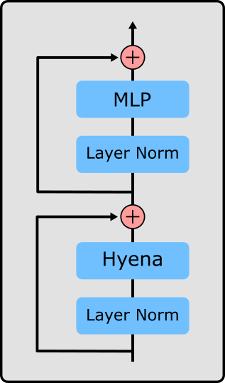
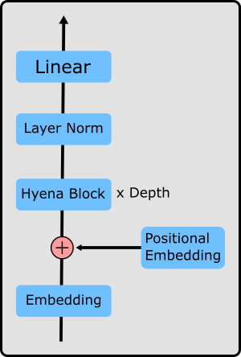

# Hyena Language Model
Language model with [Hyena Hierarchy](https://arxiv.org/abs/2302.10866)

## Model
**HyenaBlock**



**HyenaLM**



## Usage

```py
import torch
from hyenalm.model import HyenaConfig, HyenaLM

embed_dim=32
max_seq_len = 32
vocab_size = 100
depth = 3

config = HyenaConfig(
    embed_dim=embed_dim,
    max_seq_len=max_seq_len,
    activation="gelu"
)
model = HyenaLM(vocab_size, depth, hyena_config=config)

x = torch.randint(0, vocab_size, (1, max_seq_len))
model(x)
```
